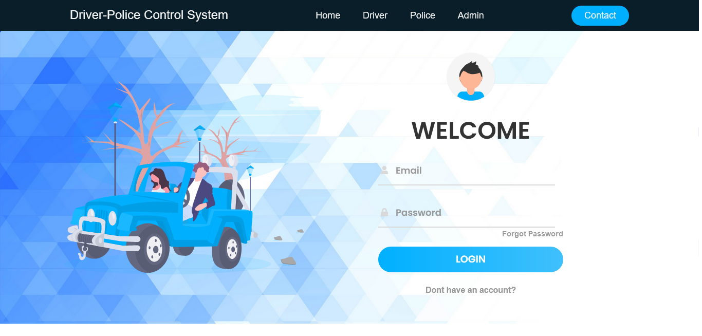
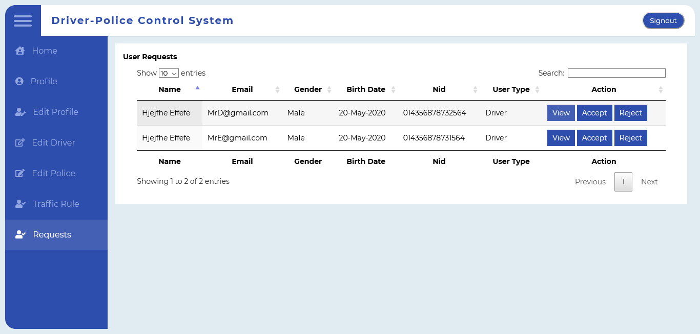

## CSE311-Online-Interactive-Driver-Police-Control-System
##### Course Code: CSE311 (Database System)
##### This Project was a part of CSE311L at North South University . This Project was developed by I (Sayed Noman) along with my two other group-mates Zahid and Tawfiq.

# “Online Interactive Driver-Police Control System”
### Introduction:
Online Driver-Police Interactive Control System is an idea to bring together all drivers and traffic polices under one digital platform and control them by one higher authority. This Interactive System will be a Web Browser based application. This will be a multi user control system based application namely-Driver, Police and Admin. Where it’s user will be allowed to make a request to join this platform and accepted members by the admin will be able to see their current status on the website. Drivers will be given a certain points and the points will decrease based around their actions and Admin will have the higher power to judge them whether drivers are eligible to drive or not. Traffic Police will have the authority to check validation papers submit case against any driver connected to the system. Admin will hold the highest authority here and will decide whether a driver or a police is eligible to stay or not.
The main objective of the development of the project is to build a website using Hypertext Markup Language that will enable the programmer to learn the right way of conducting analysis and development of a web based software and will also enable the programmer to how to collect data, manage and interpret and draw conclusion from them using a Database. The followings are the language for the development of the Website:

•	HTML
•	CSS
•	JAVA SCRIPT
•	PHP
•	SQL

HTML(Hypertext Markup Language), CSS(Cascading  Style and Sheets) and Java Script will be used to design the Frontend which will help to display designed documents in web browser. SQL(Standard Query Language) will be used to design the Backend and  SQL will work as a DDL(Data Definition Language) and DML(Data Manipulation Language) to create  Databases and manage them. PHP(Personal Home Page) will be used create Connection between frontend and backend. 
The main purpose of this project is to increase transparency between a driver and a police and decreasing the level of harassment Driver-police face maintaining traffic rules in a digital way.

### Few Screen-shots of webpages:

